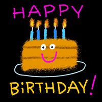

# Interactive Birthday Celebration Webpage for my Ate 🎉

An elegant, interactive web application designed to deliver personalized birthday wishes. This project combines modern web technologies with engaging animations to create a memorable digital birthday experience.

## ✨ Features

### Interactive Elements
- Dynamic welcome interface with smooth transitions
- Animated countdown sequence
- Real-time confetti effects
- Floating animations and visual elements

### Audio Integration
- Integrated background music player
- Custom audio controls with play/pause functionality
- Real-time playback timer display

### Visual Design
- Modern, responsive layout
- Carefully crafted color palette
- Smooth animations and transitions
- Cross-device compatibility

## 🛠️ Technical Stack

- **Frontend**: HTML5, CSS3, Vanilla JavaScript
- **Animations**: CSS Keyframes, JavaScript Animations
- **Effects**: Confetti.js
- **Design**: Responsive Flexbox Layout
- **Performance**: Optimized asset loading

## 🚀 Quick Start

1. Clone the repository
2. Open `index.html` in a modern web browser
3. Click "Enter" to begin the celebration
4. Experience the interactive birthday sequence

## 💻 Browser Support

- Chrome (recommended)
- Firefox
- Safari
- Edge

## 📱 Responsive Design

Fully responsive design that adapts to:
- Desktop displays
- Tablets
- Mobile devices

## ⚡ Performance

- Optimized asset loading
- Smooth animations
- Minimal dependencies

## 📝 License

This project is licensed under the MIT License - see the [LICENSE](LICENSE) file for details.

---

Crafted with 💝 as a special birthday tribute

